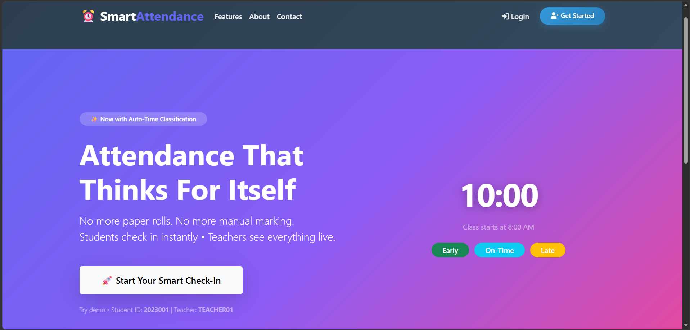
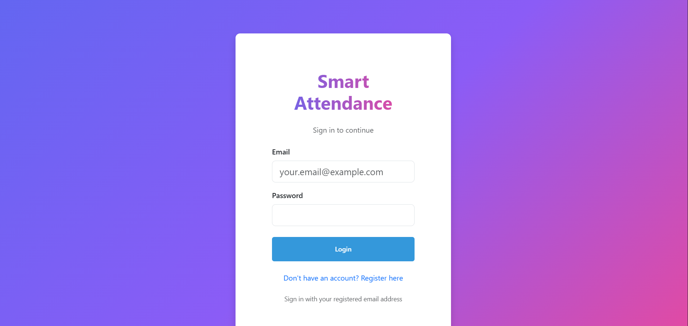
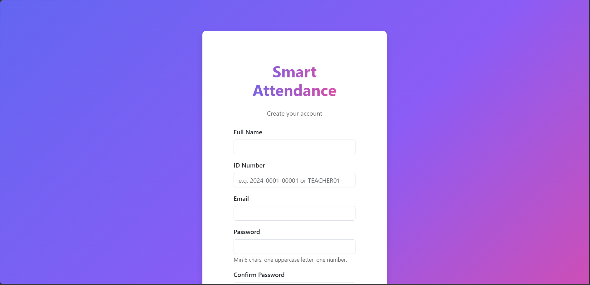
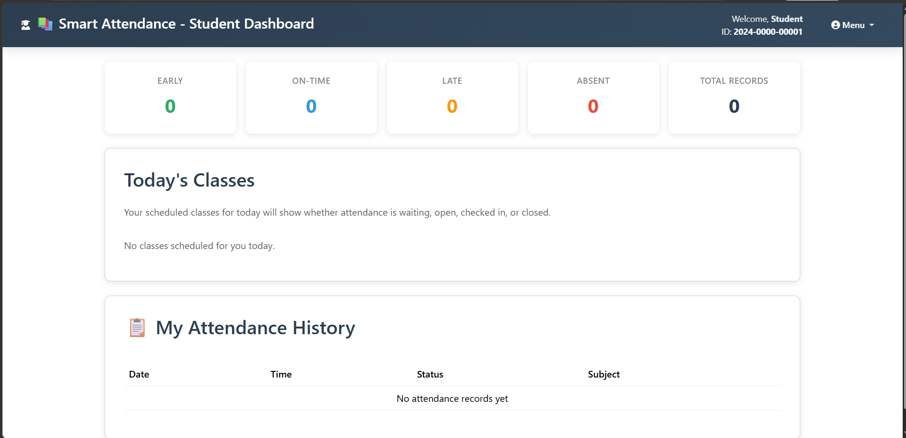
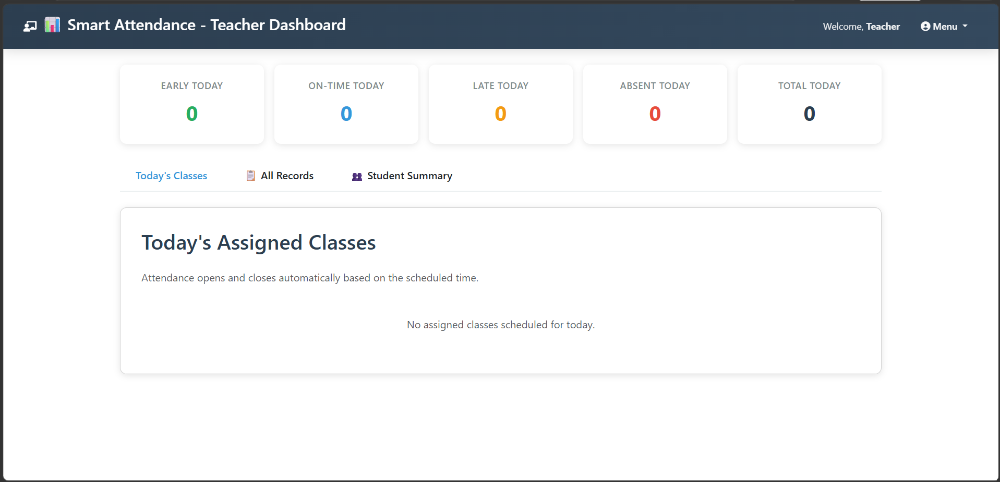
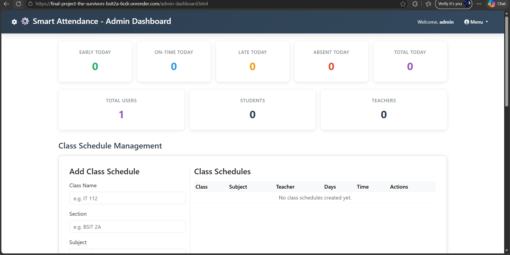

# Smart Attendance System with Auto-Time Classification

<p align="center">
  
</p>

<p align="center">
  <strong>Efficient • Accurate • Automated</strong>
</p>

---

## Project Overview

The Smart Attendance System is a complete web application for schools and training centers that automates attendance tracking with time-based classification and role-based dashboards.

It includes:

- Multi-role authentication for students, teachers, and admins.
- Student check-in workflows with class/session-aware attendance.
- Teacher and admin dashboards for attendance monitoring and summaries.
- Class roster, class schedule, and session management.
- Real-time attendance status updates backed by MongoDB.

---

## Implemented Features

### Authentication & User Management

- Register and login with email and password.
- JWT-based protected routes.
- Role-based access control for `student`, `teacher`, and `admin`.
- Admin-only user management endpoints.

### Attendance & Session Tracking

- Student check-in via `/api/attendance/checkin` and `/api/attendance/checkin-session`.
- Automatic arrival classification: `On-Time`, `Late`, `Absent`.
- Auto-generated attendance sessions from class schedules.
- Daily absence detection and auto-marking after scheduled class end.
- Teacher/admin attendance review, updates, and deletions.

### Class & Roster Management

- Class creation, listing, update, and deletion.
- Class schedule save/retrieve capabilities.
- Student enrollment and roster management.
- Session listing and session details.

### Frontend Features

- Responsive landing page with login/register navigation.
- Student dashboard and summary preview.
- Teacher dashboard and session management.
- Admin dashboard and user management pages.
- Consistent UI built with Bootstrap and custom CSS.

---

## Screenshots

### Landing Page
<p align="center">
  
</p>

### Authentication
<p align="center">
  
  
</p>

### Student Dashboard
<p align="center">
  
</p>

### Teacher Dashboard
<p align="center">
  
</p>

### Admin Dashboard
<p align="center">
  
</p>

---

## Tech Stack

- Frontend: HTML, CSS, Bootstrap, Vanilla JavaScript.
- Backend: Node.js, Express, MongoDB, Mongoose.
- Security: JWT, Helmet, express-mongo-sanitize, rate limiting.

---

## Live Deployment

🚀 **[View Live Application](https://final-project-the-survivors-bsit2a-6cdr.onrender.com)**

---

## How to Run Locally

1. Install dependencies:

```bash
cd backend
npm install
```

2. Create a `.env` file in `backend/` with at least:

```env
MONGODB_URI=your_mongo_connection_string
JWT_SECRET=your_jwt_secret
PORT=3000
```

3. Start the backend server:

```bash
npm start
```

4. Open the app in your browser:

```text
http://localhost:3000
```

> The backend serves the frontend from `frontend/` automatically.

---

## API Summary

### Authentication

- `POST /api/auth/register` — register a new user
- `POST /api/auth/login` — login and receive JWT
- `GET /api/auth/users` — admin/teacher only list users
- `DELETE /api/auth/users/:id` — admin only delete a user

### Attendance

- `POST /api/attendance/checkin` — student check-in (legacy flow)
- `POST /api/attendance/checkin-session` — student check-in with session/class context
- `GET /api/attendance/my-attendance` — student attendance history
- `GET /api/attendance` — teacher/admin attendance list
- `GET /api/attendance/stats` — teacher/admin today's attendance stats
- `GET /api/attendance/student-summary` — teacher/admin summary by student
- `PUT /api/attendance/:id` — admin update attendance record
- `DELETE /api/attendance/:id` — admin delete attendance record

### Classroom Support

- `GET /api/classes` — list classes
- `POST /api/classes` — create classes (admin)
- `GET /api/schedule` — retrieve class schedules
- `POST /api/schedule` — save class schedules
- `GET /api/roster` — list enrolled classes (teacher/admin)
- `POST /api/roster/enroll` — enroll student (admin)
- `GET /api/roster/class/:className` — class roster (teacher/admin)
- `GET /api/sessions` — list attendance sessions
- `GET /api/sessions/:id` — session details

---

## Folder Structure

- `frontend/` — static pages and client-side scripts
- `backend/` — Express API, models, controllers, middleware
- `database/` — database route definitions and utilities

---

## Team Members & Roles

| Name                    | Role                             | Responsibilities                                       |
| ----------------------- | -------------------------------- | ------------------------------------------------------ |
| Jexson Sedon            | Project Manager                  | Project workflow management and team coordination      |
| Judy Pearl Balictar     | Frontend Manager                 | Frontend development, form validation, API integration |
| John Roan Ballester     | Backend Manager                  | Backend routes, API development, debugging             |
| Michelle Diaz           | Database Manager                 | MongoDB database management and verification           |
| Alyssa Jenille Reantaso | GitHub Manager                   | Version control, branch management, collaboration      |
| Ronel Garcia            | Documentation Officer / Debugger | Project documentation, debugging, problem-solving      |

### Team Learning Outcomes

- **Project Management** — Improved teamwork and coordination skills through efficient workflow management
- **Frontend Development** — Mastered connecting frontend forms to backend APIs using JavaScript fetch()
- **Backend Development** — Deepened understanding of routes, request processing, and MongoDB integration
- **Database Management** — Gained expertise in MongoDB data storage and verification using MongoDB Atlas
- **Version Control** — Strengthened collaboration and version control skills through organized GitHub practices
- **Documentation & Debugging** — Enhanced problem-solving abilities through thorough documentation and systematic debugging

---

## Notes

- Use the `frontend/` README for a front-end specific setup and page overview.
- The project currently runs as a full stack application from `backend/server.js`.
